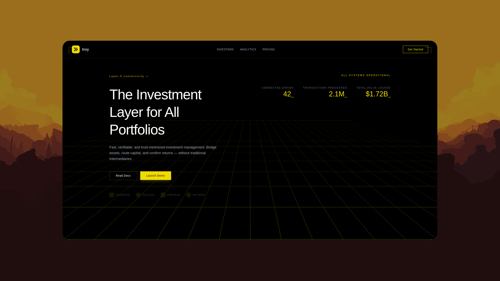

<div align="center">
  <a href="#">
    
  </a>

  <h3 align="center">Invyno</h3>

  <p align="center">
    Best Investment Tracker for Modern Investors
  </p>
</div>

## About The Project

<p align="center">
  <a href="#" target="_blank" rel="noopener">
    
  </a>
</p>

Invyno is a **Next.js** web application that can also run as a **desktop app** via **Electron**. The desktop build bundles a production Next.js server (standalone output) and packages it with 

## Prerequisites

- **Node.js** (LTS recommended, e.g. 20+)
- **npm**
- **PostgreSQL** (for API/auth and Prisma — required at runtime for the full app)
- Copy environment file: `webapp/.env.example` → `webapp/.env` and set at least `DATABASE_URL` (and any OAuth/email variables you use)

## Get Started

```bash
git clone https://github.com/ffoster007/Invyno.git
cd Invyno
```

### Linux / macOS setup

```bash
cp webapp/.env.example webapp/.env
bash setup.sh
```

### Windows setup

```powershell
copy webapp\.env.example webapp\.env
.\setup.ps1
```

## Web app (browser)

`start.sh` / `start.ps1` install dependencies, run Prisma generate, then start the Next dev server:

### Linux / macOS

```bash
bash start.sh
```

### Windows

```powershell
.\start.ps1
```

Then open [http://localhost:3000](http://localhost:3000).

> Run Command
```
npm run dev (for web)
npm run electron:dev (for desktop app)
```
## Build Desktop App (Electron) — 

Scripts under **`scripts/`** only run the **desktop packaging** 


### Linux / macOS

```bash
bash scripts/buildapp.sh
```

Produces platform artifacts under **`webapp/release/`** (e.g. **AppImage** / **deb** on Linux, **dmg** / **zip** on macOS).

### Windows

```powershell
.\scripts\buildapp.ps1
```

Produces **`webapp/release/Invyno Setup *.exe`** (NSIS) and **`webapp/release/win-unpacked/`**.


### Desktop build notes

- Production builds use **`next build --webpack`** so Windows standalone file tracing does not hit invalid `:` characters from Turbopack.
- **`webapp/scripts/prepare-standalone.cjs`** copies `public` and `.next/static` into the standalone bundle (on Windows it uses **robocopy** for reliability on some paths).
- Client-side API calls use **relative URLs** in the browser so they match the embedded server port inside Electron.

